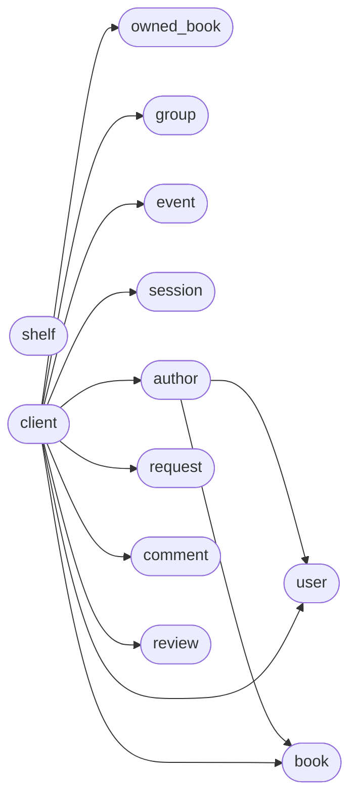

# Code Overview

[_Documentation generated by Documatic_](https://www.documatic.com)

<!---Documatic-section-Codebase Structure Python-start--->
## Codebase Structure Python

The codebase has a flat structure, with 13 code files.

<!---Documatic-block-system_architecture-start--->

<!---Documatic-block-system_architecture-end--->

# #
<!---Documatic-section-Codebase Structure Python-end--->

<!---Documatic-section-File IO-start--->
## File IO

<!---Documatic-block-file_io-start--->
The following files have file read operations

<!---Documatic-block-goodreads-start--->

	
<code>goodreads</code> (Click to Expand!)

* goodreads.client

<!---Documatic-block-goodreads-end--->
<!---Documatic-block-file_io-end--->

# #
<!---Documatic-section-File IO-end--->

<!---Documatic-section-Class Hierarchy-start--->
## Class Hierarchy

<!---Documatic-block-goodreads.request.GoodreadsRequestException-start--->

	
<code>goodreads.request.GoodreadsRequestException</code> (Click to Expand!)

* goodreads.request.GoodreadsRequestException

<!---Documatic-block-goodreads.request.GoodreadsRequestException-end--->

# #
<!---Documatic-section-Class Hierarchy-end--->

[_Documentation generated by Documatic_](https://www.documatic.com)